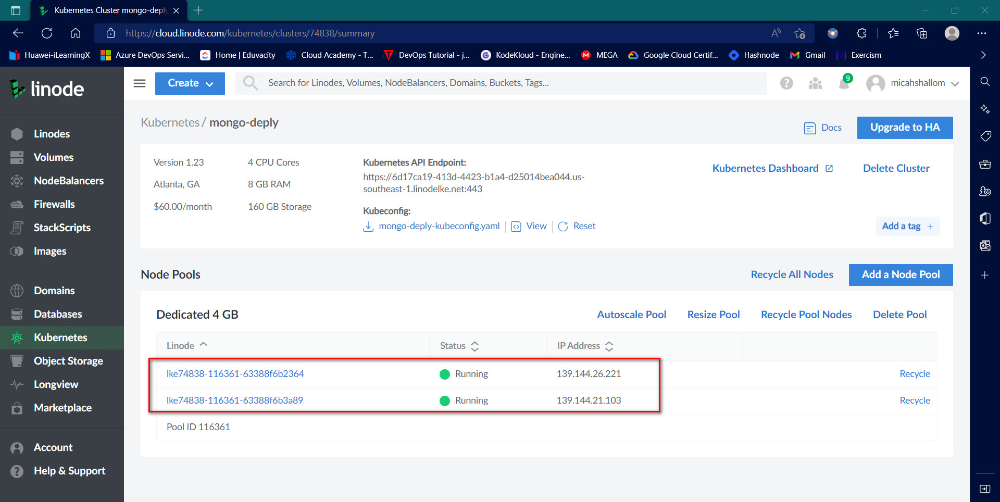
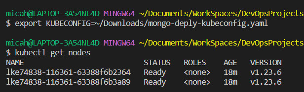
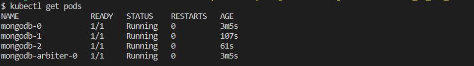
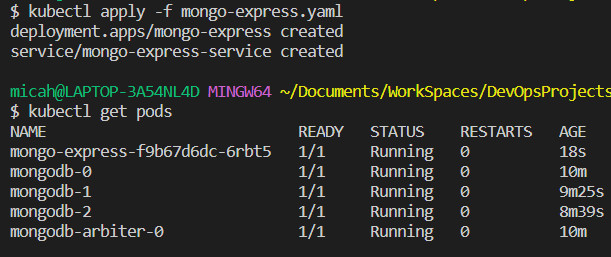
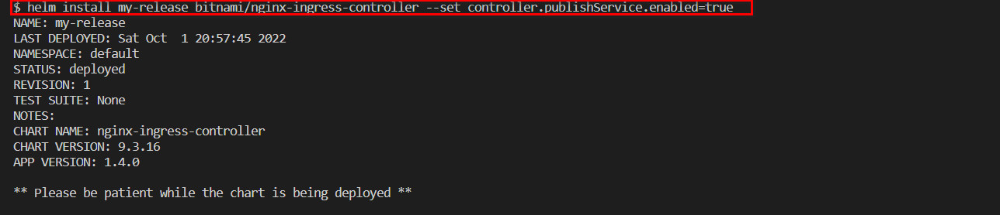
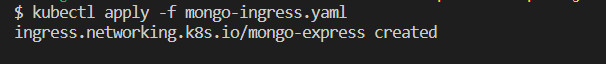
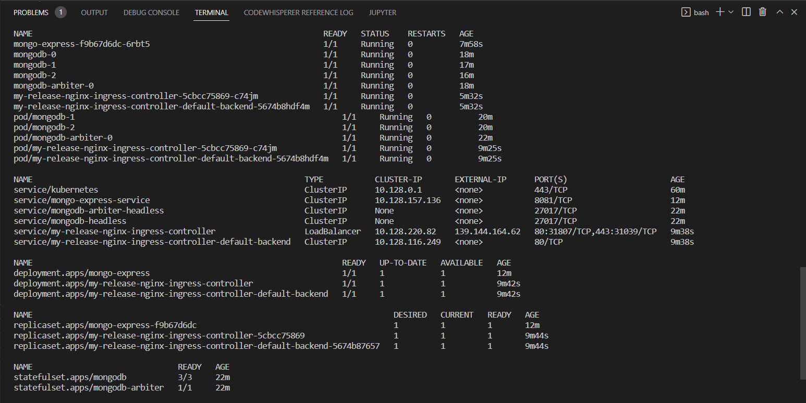

# StatefulSets_on_K8s_Cluster
Building a mongodb using statefulsets for efficient database persistence

Login into Linode and creating a Linode Kubernetes Cluster with 2 nodes

Authenticate by exporting the config file as KUBECONFIG

Getting bitnami repository from circleci
`helm repo add bitnami https://charts.bitnami.com/bitnami`

### Installing mongodb deployment from the bitnami repository helm and tweaking some parameters by passing a values file
`helm install mongodb --values mongodb-values.yaml bitnami/mongodb`

### deploying mongo-express deployment to connect with the mongodb pods.
Note this connection is established by providing `mongodb-0.mongodb-headless` as the connection parameter to the mongodb-pods created using helm.
`kubectl apply -f mongo-express.yaml`

### installing an nginx ingress controller deployment using helm
`helm install my-release bitnami/nginx-ingress-controller --set controller.publishService.enabled=true`

### deploying ingress to connect with the internal service of the mongo express deployment
`kubectl apply -f mongo-ingress.yaml`

### experimenting on deployment by taking the replicaset to zero then scaling it to a number above zero. You will see that the storage class logically provisions new physical volumes based on the pods present and ensures the right pod is being connected to the right volume.
`kubectl scale --replicas=0 statefulset/mongodb`
`kubectl scale --replicas=3 statefulset/mongodb`

